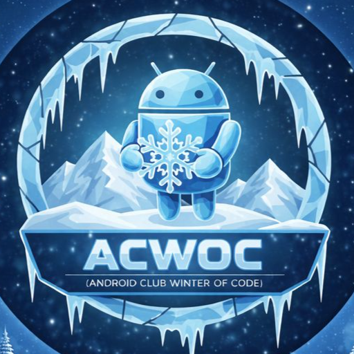

# AcWoC Discord Bot
<div>
	
	
  
	
	
</div>
<br>
This is the source code of the AcWoC bot, made for AcWoC's Discord server.<br>
The bot supports both slash and chat commands.

Chat commands prefix: **`a.`**<br>
Sample usage: 
- **`a.<command_name>`**<br>
	or
- **`/command_name`**
<br><br>

# Commands

Following commands are available with the discord bot.<br>
> Note: Aliases are available only for chat commands. This is intentional, as it keeps the slash command menu clean and easy to navigate.

- `help`
  - Replies with a link that points [here](#commands).

- `ping`
  - Shows the time it takes (in milliseconds) for the bot to send a message to discord.

- `gitconnect <(optional) code>`
  - > This command is DM only<br> i.e you can only use this by directly messaging the bot.
  - Links a GitHub account with the discord account that used this command using a code obtained from the OAauth app.
  - Arguments
    - ***code*** (optional) is the github code obtained from the OAauth app whose link will be provided after running this command without supplying this argument.
  - Aliases:
   `gc`, `gitc`

- `leaderboard <(optional) rank>`
  - If rank is specified, returns the user profile of the contributor at that rank.
  - Otherwise shows the details of the top 3 contributors.
  - Arguments
    - ***rank*** (optional) is the rank of the contributor whose profile you want to see
  - Aliases:
    `ld`, `leader`, `leaders`

- `profile <GitHub username or @DiscordAccount>`
  - Returns the user profile of the specified contributor
  - Arguments
    - GitHub username of the contributor OR linked discord account @mention of the contributor.
  - Aliases:
    `user`, `pf`, `contributor`, `contrib`

- `viewlinked <GitHub username or @DiscordAccount>`
  - Shows the linked GitHub and Discord account.
  - Can be used to find the linked discord or the github account of a maintainer / contributor.
  - Arguments
    - GitHub username OR @mention linked discord account.
  - Aliases:
    `vl`, `vlinked`, `viewl`

- **ADMIN ONLY:** `forward <channel> <message content>`
  - Sends a text message supplied as an argument to the command to a channel also specified in the command.
  - Arguments:
    - ***channel*** can be any text channel's id or direct reference using #channel as long as the bot has permission to send messages in that channel.
    - ***message content*** limit is 2000 characters, but you should take a margin of ~33 characters since you will not be able to send the command if it exceeds the limit itself, unless you have nitro.
  - Aliases:
    `send`, `say`

# Running from Source
- Ensure you have NodeJS, npm installed.
- Clone this repository
- `cd` into the root of this repository
- Make a `.env` file with the following content:
    - ```dotenv
        PREFIX = "a."
        BTOKEN = "<YOUR BOT TOKEN>"
        CLIENTID = "<BOT APPLICATION ID>"
        LEADERBOARD_FETCH_URL = "<LEADERBOARD JSON URL>"
        HELP_README_URL = "<LINK TO README.md>"
        ADMINS = "admin_userid_1,admin_userid_2"
      ```
- Install dependencies:
    - ```bash
        npm i
      ```
        OR If you have pnpm installed
    - ```bash
        pnpm i
      ```
- Run the bot (dev):
    - ```bash
        npm start
      ```
- Production:
    - build command:
      ```bash
        npm run build
      ```
    - start command:
      ```bash
        npm run start:prod
      ```